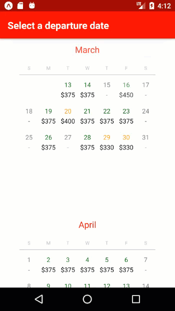

# MockingBird

(I came up with this pun after naming everything, sorry)

## Table of Contents

* [What is it](#what-is-it)
* [What has been added](#what-has-been-added)
* [What needs to be added](#what-needs-to-be-added)

## What is it

This is a recreation of Blackbird's iOS app calendar screen in React Native.
It is adapted from the [react-native-calendars](https://github.com/wix/react-native-calendars) library with modifications and new components.

**[Try it on Appetize](https://appetize.io/app/njv1hdhvutwb97ftcpp0dcymtw?device=nexus5&scale=75&orientation=portrait&osVersion=7.1)**

<iframe src="https://appetize.io/embed/njv1hdhvutwb97ftcpp0dcymtw privateKey: private_q4rd2hy6kpvfc5n1276fh88uyc?device=iphone5s&scale=100&autoplay=true&orientation=portrait&deviceColor=black" width="378px" height="800px" frameborder="0" scrolling="no"></iframe>

  
Scan to load in your Expo App

   
Before and After

## What has been added

* New subcomponent `Price` under `Day` to hold pricing data
  -- Data is loaded in at the top component level via the `priceData` JSON
* Supression of past days and weeks via a new prop, `hidePreviousDays`
* Contextual styling on days depending on flight availability

* Reformatting to match Blackbird's style  
  -- Day of the week rendered as a single letter  
  -- Date header with a horizontal span

## What needs to be added

* Sticky headers for scrolling  
  -- `react-native-calendars` renders the entire calendar with header as a FlatList item, so the header needs to be rendered separately to support this
* Modal for booking flights

* Resolve spacing issue for weeks with less than 7 rendered days

* Custom fonts
* Selecting date ranges

## How I made this

Prior to making this app I had no experience with React Native. This app was made in a day, including setting up an Android development environment on my computer. A rough breakdown of the hours spent:

**Hours 0-2**: Setting up the Android development environment and scoping project  
**Hours 2-4**: Learning the `react-native-calendar` library and making cosmetic changes to match the Blackbird app  
**Hours 4-6**: Implementing functional features like rendering data from JSON and supression of past dates  
**Hours 4-8**: Creating documentation
